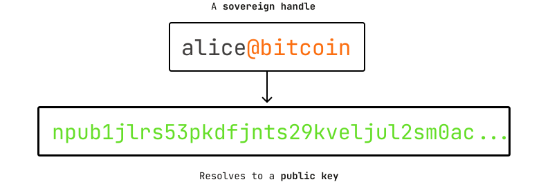

# Spaces on Bitcoin

_Spaces_ are nice & memorable sovereign handles anchored in Bitcoin with minimal on-chain footprint. They are easier to share compared to an [`npub`](https://github.com/nostr-protocol/nips/blob/master/19.md#bare-keys-and-ids), and can be used to sign things just like a regular public key!&#x20;

<figure><figcaption></figcaption></figure>

## What makes spaces special?

Spaces are anchored in Bitcoin, the most secure Proof-of-Work blockchain, and have the following properties:

* Primary spaces are community identifiers, capped at \~3600 per year, acquired through permissionless auctions on the Bitcoin blockchain.
* Each primary _Space_ is a community that may issue sovereign handles off-chain known as _subspaces._
* Spaces AND subspaces (once allocated) are permissionless and as secure as Bitcoin itself! No bridges, slashing, or any kind of optimistic security.
* The spaces protocol is designed with zk-light clients in mind making these identities verifiable on resource constrained devices.
* Subspaces do not need to trust the community operator once allocated, and they can do 100% of their transactions on-chain if they wish.
* Minimal on-chain footprint.

## Spaces vs. ENS

For full verification, you can sync the entire spaces protocol with a pruned Bitcoin full node on an old Raspberry PI. Bitcoin is the most secure Proof-of-Work blockchain today, and it's relatively lightweight compared to running an Ethereum node. The majority of ENS integrations trust centralized third-parties defeating the whole purpose of decentralized identities.

## Jump right in

<table data-view="cards"><thead><tr><th></th><th></th><th data-hidden data-card-cover data-type="files"></th><th data-hidden></th><th data-hidden data-card-target data-type="content-ref"></th></tr></thead><tbody><tr><td><strong>Getting Started</strong></td><td>Download and install spaces</td><td><a href=".gitbook/assets/Fabric bg (1).svg">Fabric bg (1).svg</a></td><td></td><td><a href="getting-started/quickstart.md">quickstart.md</a></td></tr><tr><td><strong>Deep Dive</strong></td><td>Understand how the protocol works</td><td><a href=".gitbook/assets/Fabric bg (1).svg">Fabric bg (1).svg</a></td><td></td><td><a href="deep-dive/spec.md">spec.md</a></td></tr><tr><td><strong>Explorer</strong></td><td>Checkout the explorer</td><td><a href=".gitbook/assets/Fabric bg (1).svg">Fabric bg (1).svg</a></td><td></td><td><a href="https://explorer.spacesprotocol.org">https://explorer.spacesprotocol.org</a></td></tr></tbody></table>
