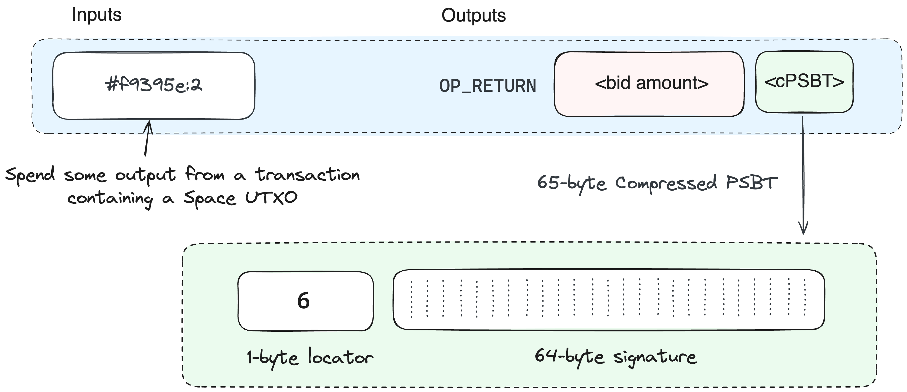

# Spec

## Auctions

The auction mechanism involves selecting some UTXO to represent the Space, which is "passed" around between bidders until the auction concludes. Bidders leave a partially signed Bitcoin transaction (PSBT) stating, "If I'm outbid, the next person may spend my space output, on the condition they return my bid to me". Bid amounts are sent to an OP\_RETURN address, which also carries the Bid PSBT in a compressed format.

As the auction progresses, each new bidder consumes the previous space output and creates a new one. This process continues until the final space output is created by the winner. The burning of funds happens incrementally. For example, if Alice places an initial bid burning 1000 sats, and Bob wants to bid 1500 sats, Bob would refund Alice's 1000 sats and burn an additional 500 sats. Since all bids are attempting to spend the same UTXO, the Bitcoin blockchain will still guarantee that only one of the bids manages to burn their coins during simultaneous bidding. For this reason, it's important to burn a small amount in the initial bid because the auction isn't established yet.


## Bid Psbt Format


If you would like to manually construct bid transactions, you can use the Spaces Wallet CLI to get the bid contract signature for the auctioned space output, total burned and other details:\
\
$ `space-cli getspace myspacename`


The bid PSBT spends an _auctioned_ space output and refunds the previous bidder's burned coins. Bid PSBTs must follow the exact structure defined here otherwise it would not be possible to re-construct it from the compressed form:


| Field              | Value |
| ------------------ | ----- |
| **TX** **Version** | 2     |
| **Lock Time**      | 0     |

**Input**

| Field           | Value                  |
| --------------- | ---------------------- |
| Previous Output | `prev_txid:prev_index` |
| Sequence        | `0xFFFFFFFD`           |
| Sighash type    | `SINGLE\|ANYONECANPAY` |

**Output**

| Field         | Value                       |
| ------------- | --------------------------- |
| Script Pubkey | `prev_script_pubkey`        |
| Value         | `total_burned + prev_value` |

Where:

* `prev_txid:prev_index` refers to the transaction ID and output index of the previous auctioned space UTXO.
* `total_burned` is the total amount of coins burned during the auction until this point.
* `prev_value` is the value of the previous output (`prev_txid:prev_index`)
* `prev_script_pubkey` the exact p2tr script pubkey of (`prev_txid:prev_index`)

**Compressing Bid PSBT to 65 bytes**

<figure><picture><source srcset="../.gitbook/assets/cpsbt-dark.png" media="(prefers-color-scheme: dark)"></picture><figcaption><p><br>In this example, the Space UTXO would be identified with the outpoint <code>#f9395e:6</code></p></figcaption></figure>

To fit the PSBT into a single OP\_RETURN (80-byte limit), we:

1. Omit known details (tx version, input sequence, lock time).
2. Use transactions with at least two unspent outputs for auctions (these outputs must be [tracked](broken-reference) by the protocol).
3. Encode information in this format:

| **Inputs**                              | **Outputs**                                                                                                                |
| --------------------------------------- | -------------------------------------------------------------------------------------------------------------------------- |
| Previous Output: `prev_txid:prev_index` | <p>Script Pubkey: <code>OP_RETURN OP_PUSHBYTES_65 prev_index_2:64-byte sig</code><br>Value: <code>bid_increment</code></p> |

Where:

* `prev_txid`: Transaction ID containing the UTXO to be auctioned
* `prev_index`: Any output index from `prev_txid` (references the transaction)
* `prev_index_2`: Index of the output to be auctioned (1 byte)
* `64-byte sig`: Schnorr signature
* `bid_increment`: The current bid increment which equals the bid amount minus the total burned in prior bids and must be greater than zero

Total size: 65 bytes (1 byte + 64 bytes), fitting within the OP\_RETURN limit.


## Making bids

A bid transaction carries a Bid PSBT and consumes a previous Bid PSBT (if any)

| Inputs/Outputs                               | Notes                              |
| -------------------------------------------- | ---------------------------------- |
| Carried bid psbt input/output pair           | Offers a new UTXO for the next bid |
| Re-constructed refund psbt Input/Output pair | Spends auctioned UTXO              |

In scenarios where multiple bids are placed simultaneously on the same auctioned space output from the re-constructed PSBT, only one bid will succeed in burning the coins.


## **Open Transactions**


When opening an auction for a space, avoid placing large initial bids. If two auctions for the same space are opened simultaneously, only the first to be included in a block will establish the auction process for that space. To mitigate potential losses, the Spaces wallet currently defaults to 1000 sats for initial bids.


An open transaction is exactly the same as a bid transaction except it includes a [space script](broken-reference) which reveals the name in the witness.

```
OP_OPEN <sname>
```


## Claiming a space


Attempting to register a space before the claim period will invalidate the auction causing the current holder to lose their bid without successfully registering the space.


Once a space enters the claim period, the current space output holder i.e the winner can safely register it. It's important to note that auctions remain open indefinitely until the winner claims. The registration process itself is straightforward: a register transaction is identical to a [transfer](broken-reference) and requires no additional metadata.


#### How does the protocol distinguish bid spends from claim spends?

Since bidding is still possible in the claim period, the protocol determines if a spend of a space output is a bid spend if the following conditions are met:

* The transaction version, lock time, input sequence for the space output spend, ... etc match the [Bid PSBT](auctions.md#bid-psbt-format) format.
* It's a P2TR key spend with a signature matching exactly the one carried out in the PSBT.

In all other cases it will be interpreted as a claim.


## Moving Space Utxos

<figure><picture><source srcset="../.gitbook/assets/space-utxos-dark.png" media="(prefers-color-scheme: dark)"></picture><figcaption></figcaption></figure>

Space UTXOs are indistinguishable from standard Bitcoin UTXOs and may carry any value. Spaces can be transferred by following a simple rule. If the space is at input index N, then it will be at output index N + 1.

## Listing spaces for sale

You can sell spaces in a trustless way by creating a PSBT with the space as an input and required payment as the output signed with `SINGLE|ANYONECANPAY`. Then anyone can complete the transaction paying the required amount and getting the Space as one of their outputs.


## Script format


Scripts are very simple. They're are embedded within standard Bitcoin scripts and are interpreted as a NOP by the Bitcoin blockchain but they define protocol specific operations on top of what can already be specified with Bitcoin scripting capabilities.

Scripts are identified with a 4-byte magic (0xDE repeated) followed by an op code and its data

For example, to encode the following space script:

<pre><code><strong>OP_OPEN @cosmos
</strong></code></pre>

It would look like this when embedded as a Bitcoin script:

```
OP_PUSHBYTES_12 dededede0106636f736d6f73
OP_DROP
```

The protocol will read any push bytes in the transaction for spends of outputs relevant to the protocol looking for the magic prefix.


The following are the op codes useable within a space script

<table><thead><tr><th width="195">OP</th><th width="161">Code</th><th width="157">OP Data</th><th>Description</th></tr></thead><tbody><tr><td>OP_OPEN</td><td>0x01</td><td>Length prefixed space name</td><td>Reveals the space name for auction. Requires a <a href="broken-reference">Bid PSBT</a> to be carried in the transaction</td></tr><tr><td>OP_SETFALLBACK</td><td>0x02</td><td>Length prefixed bytes</td><td>Associates the given bytes with the spaces being spent. Use this only if necessary as solutions like Fabric are off-chain and more efficient.</td></tr><tr><td>OP_RESERVE_1..4</td><td>0xFC to 0xFF</td><td>--</td><td>Marks space as reserved until the specific op code is enabled in a future upgrade</td></tr></tbody></table>

All other op code values are interperted as a NOP.


## Tracking UTXOs

The Spaces protocol tracks relevant Unspent Transaction Outputs (UTXOs) instead of monitoring the entire Bitcoin UTXO set. This approach allows clients like [spaced](https://github.com/buffrr/spaces-docs/blob/main/deep-dive/broken-reference/README.md) to operate without relying on the full Bitcoin UTXO set database, enabling them to sync using Simplified Payment Verification (SPV). This selective tracking also enables faster sync since the protocol does not need to check the witness of every input in every transaction looking for [space script](broken-reference)[s](broken-reference). Additionally, it enables building a smaller more lightweight version of [Utreexo](https://eprint.iacr.org/2019/611) for the zk-light clients.

The protocol automatically tracks any space outputs. However, for transactions creating [auctioned outputs](broken-reference) and/or committing to P2TR [space scripts](broken-reference), you need to indicate that such transactions are creating outputs relevant to the protocol:

* The transaction must use a special locktime ending with `222`
* Within such transactions, any outputs with a value ending in `2` are tracked.

While this may occasionally result in false positives, these are removed from the tracked set once they're spent.


## Covenants

While Bitcoin itself doesn't have native [covenant](https://bitcoinops.org/en/topics/covenants/) capabilities, protocol-specific spending conditions can be implemented for space outputs. If these conditions are not met, the space is revoked, effectively enforcing how space outputs can be spent.

<table><thead><tr><th width="150">Covenant</th><th>Properties</th><th>Covenant Definition</th></tr></thead><tbody><tr><td>bid</td><td>claim_height: Block height at which the auction winner may safely claim the space. If null, it means space is in pre-auctions</td><td>Spends of this output must be bid spends creating other bid outputs unless the `claim_height` is reached in which case it acts as a transfer covenant for the winner.</td></tr><tr><td>transfer</td><td>expire_height</td><td>Spends of this output must create a corresponding output at N+1. Once the `expire_height` is reached, this essentially becomes anyone can spend in the sense that the space can be -reopened for auction.</td></tr><tr><td>reserved</td><td></td><td>If a space uses one of the reserved op codes, it will be reserved until a future upgrade enables that op code. This is to enable future extensibility.</td></tr></tbody></table>

