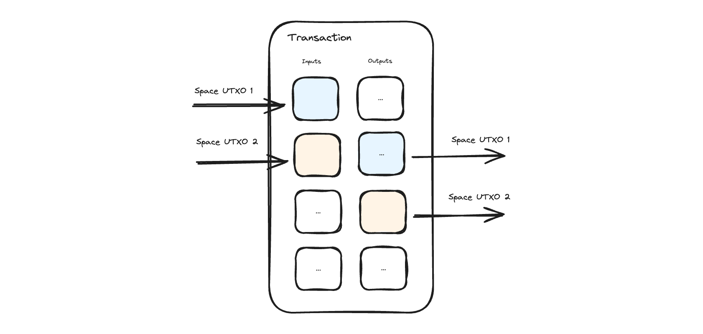

# Moving Spaces

<figure><picture><source srcset="../.gitbook/assets/space-utxos-dark.png" media="(prefers-color-scheme: dark)"></picture><figcaption></figcaption></figure>

Space UTXOs are indistinguishable from standard Bitcoin UTXOs and may carry any value. Spaces can be transferred by following a simple rule. If the space is at input index N, then it will be at output index N + 1.

## Listing Spaces for Sale

You can sell spaces in a trustless way by creating a PSBT with the space as an input and required payment as the output signed with `SINGLE|ANYONECANPAY`. Then anyone can complete the transaction paying the required amount and getting the Space as one of their outputs.

