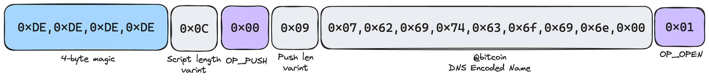

# Space Scripts


Script format is still experimental and may change before launch on Bitcoin mainnet


Space scripts are embedded within standard Bitcoin scripts and are interpreted as a NOP by the Bitcoin blockchain but they define protocol specific operations on top of what can already be specified with Bitcoin scripting capabilities.

Scripts are identified with a 4-byte magic (0xDE repeated) followed by the script length encoded as [varint](https://docs.rs/bitcoin/latest/bitcoin/consensus/encode/struct.VarInt.html) followed by the script. The script may span over multiple Bitcoin push bytes. \\

For example, to encode the following space script:

```
@bitcoin
OP_OPEN
```

It would look like this

<figure><picture><source srcset="../.gitbook/assets/space-script-dark.png" media="(prefers-color-scheme: dark)"></picture><figcaption><p><code>@bitcoin OP_OPEN</code></p></figcaption></figure>

\
Embedded in a Bitcoin script:

```
OP_PUSHBYTES_17 dededede0c000907626974636f696e0001
OP_DROP
```

Space scripts could be embedded across a series of consecutive OP\_PUSHBYTES. This makes space scripts very flexible and enable future extensibility. To make it into a valid Bitcoin script you need to drop those bytes off the stack using either `OP_DROP` or `OP_FALSE OP_IF <script> OP_ENDIF`

### Space Op Codes

The following are the op codes useable within a space script

<table><thead><tr><th width="195">OP</th><th width="117">Code</th><th width="96">Input</th><th width="85">Output</th><th>Description</th></tr></thead><tbody><tr><td>OP_PUSH</td><td>0x00</td><td>&#x3C;varint></td><td>data</td><td>Pushes the specified data to the stack</td></tr><tr><td>OP_OPEN</td><td>0x01</td><td>&#x3C;space name></td><td>--</td><td>Removes the top stack item. Reveals the space name for auction. Requires a <a href="bid-psbt.md">Bid PSBT</a> to be carried in the transaction</td></tr><tr><td>OP_SET</td><td>0x02</td><td>&#x3C;vout>&#x3C;bytes></td><td>--</td><td>Removes the top stack item; associates the given bytes with the space output at the specified index</td></tr><tr><td>OP_SETALL</td><td>0x03</td><td>&#x3C;bytes></td><td>--</td><td>Removes the top stack item; associates the given bytes with all spaces being transferred in this transaction</td></tr><tr><td>OP_NOP_4 ... 1D</td><td>0x04..0x1D</td><td>--</td><td>--</td><td>Nothing</td></tr><tr><td>OP_RESERVE ... FF</td><td>0x1E..0xFF</td><td>--</td><td>--</td><td>Marks space as reserved until the specific op code is enabled in a future upgrade</td></tr></tbody></table>

