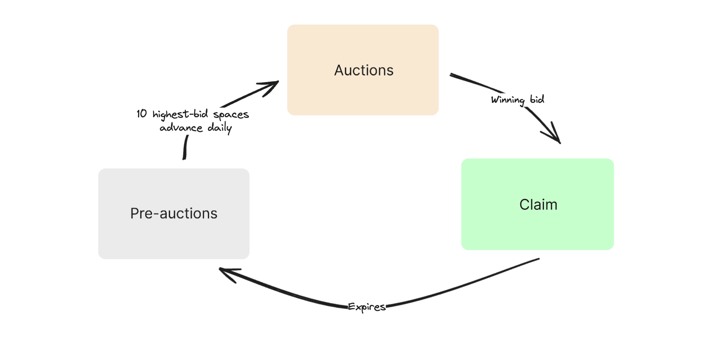

# Understanding Auctions

Spaces enable auctions with arbitrary bids implemented directly on the Bitcoin blockchain. Auctions are designed as a fair competition for naming rights. Instead of distributing spaces on a first-come, first-served basis, the protocol employs a bidding system. This approach helps ensure that valuable names don't all end up concentrated in the hands of a few quick actors.&#x20;

Space auctions are restricted to 10 per day to prevent market flooding and to ensure each name receives adequate attention.

<figure><picture><source srcset="../.gitbook/assets/auctions-dark.png" media="(prefers-color-scheme: dark)"></picture><figcaption>
Space lifecycle
</figcaption></figure>

### Pre-auctions

* Users propose spaces they're interested in by placing bids
* Each proposed name accumulates interest based on the value of the bids it receives
* Names advance to the auction phase when they become one of the top 10 highest-bid spaces on a given day
* The protocol releases up to 10 spaces per day which is about 3600 per year

### Auctions

* Once a name receives sufficient interest by being one of the top 10 highest-bid spaces on a given day, it enters the auctions phase.
* Auctions last for 10 days.
* Anyone can bid just as they normally did in pre-auctions.
* To prevent sniping, any last-minute bids extend the auction by one day.

### Claim Period

* Once the 10-day auction concludes, the winning bidder may claim their space.
*   It's crucial for the winner to claim immediately because:

    1. The auction remains open indefinitely until the space is claimed.
    2. Someone can still outbid you during this period.

### Where do proceeds from Auctions go?

All proceeds from the auctions are burned. This means that the BTC used for bids is permanently removed from circulation. This approach ensures that no single entity profits from the auctions. Names aren't anyone's property to begin with! The Spaces protocol is built on cypherpunk principles, emphasizing decentralization, privacy, and individual empowerment that means:

* No Premine: There was no initial allocation of names to the developers or any centralized entity.
* No token: BTC is the currency!
* Open and Permissionless: Anyone can participate in the auctions and use the protocol without seeking permission from a central authority.
* Transparent: All auctions happen directly on the Bitcoin blockchain.

