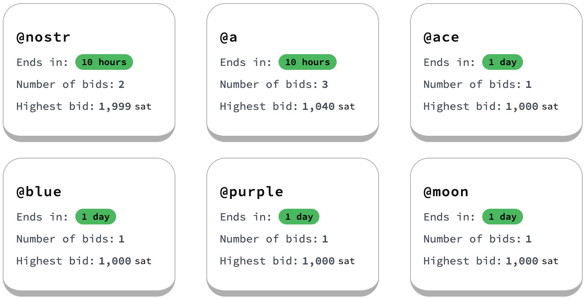

# Quickstart

<figure><picture><source srcset="../.gitbook/assets/explorer-dark.png" media="(prefers-color-scheme: dark)"></picture><figcaption><p>Spaces in the auctions phase on testnet4 check out the <a href="https://explorer.spacesprotocol.org">explorer</a></p></figcaption></figure>


### Funding Spaces Wallet

Create the default wallet and get an address to receive coins

```sh
space-cli --chain testnet4 createwallet
space-cli --chain testnet4 getnewaddress
```

You could get testnet4 coins from one of these faucets:

* [Mempool Faucet](https://mempool.space/testnet4/faucet)
* [Coinfaucet](https://coinfaucet.eu/en/btc-testnet4/)
* [Anyone](https://testnet4.anyone.eu.org/)
* [Stack Exchange List](https://bitcoin.stackexchange.com/questions/17690/is-there-anywhere-to-get-free-testnet-bitcoins/119937#119937)

For additional testnet4 resources, checkout this [guide](https://github.com/testnet4/awesome-testnet4).


### Opening an auction <a href="#opening-an-auction" id="opening-an-auction"></a>

Open an auction for some Space e.g. `@btc`

```bash
space-cli --chain testnet4 open btc
```

You will get a similar output to this

<pre class="language-json"><code class="lang-json">[
  {
    "txid": "<a data-footnote-ref href="#user-content-fn-1">1ea73982abb36cf2c62deced717fbe944c3af89abe768aa454642879b29e5adc</a>",
    "tags": ["auction-outputs", "commitment"]
  },
  {
    "txid": "<a data-footnote-ref href="#user-content-fn-2">792a2fd221e4715d6c4f330fb46309d6f6a7ed4fd0f9c50471b77e643f9885d2</a>",
    "tags": ["open"]
  }
]
</code></pre>


### Placing a bid <a href="#placing-a-bid" id="placing-a-bid"></a>

Find one of the spaces [currently in auction](https://explorer.spacesprotocol.org/) and place a bid (amount is in sats)

```bash
space-cli --chain testnet4 bid nostr 1500
```


### Check status of a Space <a href="#placing-a-bid" id="placing-a-bid"></a>

```bash
space-cli --chain testnet4 getspace btc
```

You will get something like this

<pre class="language-json"><code class="lang-json">{
  "outpoint": "<a data-footnote-ref href="#user-content-fn-3">1ea73982abb36cf2c62deced717fbe944c3af89abe768aa454642879b29e5adc:1</a>",
  "value": 662,
  "script_pubkey": "51202a7267b047254ad41e87458b902c286434e3764ffd2f2fdb46a9c8fafa6135e3",
  "name": "@btc",
  "covenant": {
    "type": "bid",
    "burn_increment": 1000,
    "signature": "........",
    "total_burned": 1000,
    "claim_height": null
  }
}
</code></pre>

You can use `listspaces` command to see all space outputs you own including outputs that are actively in auction.

The `bid` covenant indicates spending this output requires either another bid spend or a registration spend if the claim height is reached [learn more](../deep-dive/covenants.md).


### Claiming a Space <a href="#placing-a-bid" id="placing-a-bid"></a>

If you're currently winning and the space entered the claim period, you can register it!

```sh
space-cli --chain testnet4 register bitcoin
```

You will get something like this

<pre class="language-json"><code class="lang-json">{
  "outpoint": "<a data-footnote-ref href="#user-content-fn-4">b2819258b2416314a36e8f66840ebb5682e2600a07c28a04b4e27fe0b51b46fc:1</a>",
  "value": 662,
  "script_pubkey": "5120882cd5b0ef333be2efd7efd9bea0953f894677f1d5a638c8a3d13734e99d22e6",
  "name": "@bitcoin",
  "covenant": {
    "type": "transfer",
    "expire_height": 93050,
    "data": null,
  }
}
</code></pre>

You may also watch the status of auctions on the [explorer](https://explorer.spacesprotocol.org)

[^1]: Checkout this transaction here[https://mempool.space/testnet4/tx/1ea73982abb36cf2c62deced717fbe944c3af89abe768aa454642879b29e5ad](https://mempool.space/testnet4/tx/1ea73982abb36cf2c62deced717fbe944c3af89abe768aa454642879b29e5adc)

[^2]: Checkout this transaction here

    [https://mempool.space/testnet4/tx/792a2fd221e4715d6c4f330fb46309d6f6a7ed4fd0f9c50471b77e643f9885d2](https://mempool.space/testnet4/tx/792a2fd221e4715d6c4f330fb46309d6f6a7ed4fd0f9c50471b77e643f9885d2)

[^3]: Checkout this outpoint here\
    [https://mempool.space/testnet4/tx/1ea73982abb36cf2c62deced717fbe944c3af89abe768aa454642879b29e5adc#vout=](https://mempool.space/testnet4/tx/1ea73982abb36cf2c62deced717fbe944c3af89abe768aa454642879b29e5adc#vout=1)

[^4]: Check this outpoint here

    [https://mempool.space/testnet4/tx/b2819258b2416314a36e8f66840ebb5682e2600a07c28a04b4e27fe0b51b46fc#vout=1](https://mempool.space/testnet4/tx/b2819258b2416314a36e8f66840ebb5682e2600a07c28a04b4e27fe0b51b46fc#vout=1)
