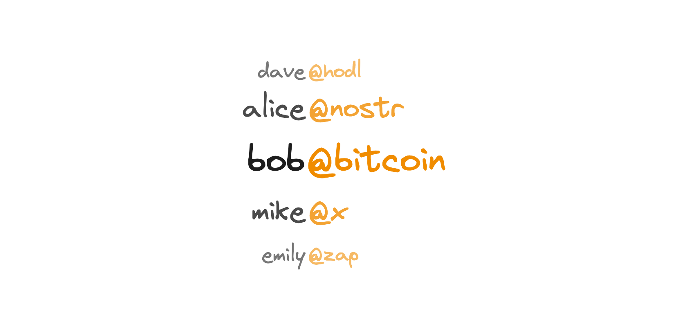

# Subspaces

<figure><picture><source srcset="../.gitbook/assets/handles-dark.png" media="(prefers-color-scheme: dark)"></picture><figcaption></figcaption></figure>

Subspaces are individual identities within a community Space. In the figure above, we see examples of this hierarchical structure:

* alice@nostr
* bob@bitcoin
* mike@x

Here, Alice, Bob, and Mike are _subspaces_ or unique identities within their respective community Spaces: @nostr, @bitcoin, and @x.

The Spaces protocol is being built in two stages. Initially, it will launch on the Bitcoin mainnet, implementing the base layer, which includes on-chain auctions and top-level Spaces. Work on Subspaces will begin after the mainnet launch and will be implemented as a soft fork.

Subspaces are key to scalability as they enable the creation of millions of individual identities within each community space. They have a much lower on-chain footprint, making them more accessible and affordable for everyone!

### Key Benefits

* Subspaces, unlike traditional domains, are sovereign and permissionless identities.
* Once issued, they cannot be taken down by their respective community.
* They can do 100% of their transactions on-chain if they wish treated the same as a parent space.
* They are cost effective to maintain.

### How You Can Engage

While we work towards implementation, you can:

* Read the [paper](https://spacesprotocol.org/paper) for initial design notes on subspaces.
* Experiment with [subspacer](https://github.com/spacesprotocol/subspacer), a tool that creates validity zk-proofs. These proofs attest that the subspaces trie was updated correctly, without revealing the individual changes.
* Read [initial thoughts](https://buffrr.dev/building-distributed-permissionless-key-value-store-o1-lookup-performance/) on storing records for spaces & subspaces off-chain.
* Join the Community: Contribute or discuss ideas, join our [Telegram group](https://t.me/spacesprotocol).
